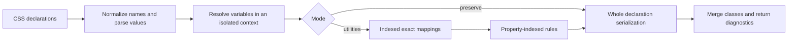

# Conversion architecture

The public API is `gen(css, variables?)` or a configured function returned by `createGenerator(options)`. Results contain `converted` classes and structured `failed` declarations. This library converts declaration objects, not stylesheets or a browser cascade.



## Module boundaries

| Module                        | Responsibility                                                                                              |
| ----------------------------- | ----------------------------------------------------------------------------------------------------------- |
| `src/index.mts`               | Public entry points and exported types. Internal modules do not import it.                                  |
| `src/core/input.mts`          | Property name hyphenation, numeric units, and `!important` extraction, following React's style conventions. |
| `src/core/engine.mts`         | Coordinates parsing, mapping, rule dispatch, and diagnostics.                                               |
| `src/core/types.mts`          | Declaration, context, rule result, and public result contracts.                                             |
| `src/core/value.mts`          | Shared value parsing, boundary validation, function parsing, and variable resolution.                       |
| `src/core/serialize.mts`      | Emits complete arbitrary properties, preserving quoted contents, literal underscores, and URL payloads.     |
| `src/core/registry.mts`       | Builds the property-to-rule index and rejects duplicate registrations.                                      |
| `src/core/mappings.mts`       | Builds exact-match candidate indexes from generated data.                                                   |
| `src/transform/rules/`        | Declarative property rules; `utility.mts` holds the shared lookup and fallback steps.                       |
| `src/transform/functions.mts` | Value normalizers used for theme lookup: px/rem conversion and colors to oklch.                             |
| `src/transform/context.mts`   | Creates immutable per-call variable/configuration snapshots.                                                |

## Input normalization

Keys are hyphenated as React does, so vendor prefixes survive (`WebkitLineClamp` → `-webkit-line-clamp`, `msTransform` → `-ms-transform`). Non-zero numbers become pixels unless the property is unitless. A trailing `!important` is removed from the value before parsing and recorded on the declaration; every class produced for that declaration gets Tailwind's trailing `!` modifier. Exact mappings are matched separately for important and normal declarations, so a combined class never mixes the two.

Exact-mapping lookup compares pure identifiers case-insensitively. Other values, such as strings, URLs, and variable names, are compared exactly and never rewritten.

## Context lifetime

There is no mutable global variable table. `gen()` creates a new context each time. `createGenerator()` snapshots its options and creates a new context on every invocation; per-call variables override configured variables only for that call. A supplied variable is resolved before its fallback. Nested fallbacks preserve commas. Cycles terminate, use the caller fallback where available, and otherwise retain the original unresolved reference.

Variable resolution is explicit substitution based on caller-provided values, not DOM computed-style evaluation. Unresolved references are preserved for the application to resolve.

## Rule contract

A rule declares its name and property list and returns a discriminated result:

```ts
type RuleResult =
  | { status: 'converted'; classes: string[] }
  | { status: 'failed'; reason: 'unsupported-value' | 'invalid-value' };
```

The registry selects a rule by property, so an `unmatched` result is unnecessary. Property support is derived from the same registrations and the exact-mapping index; there is no separately maintained support list.

Whole-declaration rules come from `atomicRule`. Every other rule comes from `utilityRule` in `src/transform/rules/utility.mts`, which declares one `Utility` per property and owns the shared steps:

1. Look up an exact theme class, using the property's optional `normalize` (px → rem, color → oklch) and preferring the theme token form of the value. A match never rewrites the value, so it is tried first.
2. Keep values with quotes, escapes, underscores, comments, unresolved `var()`, or global keywords as a whole declaration.
3. Otherwise call the property's `fallback` with the original value. The default is an arbitrary value, encoded by `encodeArbitraryValue`; `spacing` emits whole multiples of the spacing scale such as `p-4`. A `hint` adds a Tailwind data type where Tailwind would otherwise misread a keyword, such as `font-[number:bolder]` instead of a font family.

Rules cannot read invocation state. Add a property by declaring its `Utility`, registering the rule once, and adding a public-entry regression and compiled CSS assertion. Duplicate registrations fail at initialization rather than silently depending on array order.

## Completeness and optimization

A result must account for the entire declaration. Background, border, box-shadow, transforms, filters, and transitions emit whole arbitrary properties. This preserves shorthand reset behavior, repeated functions, unknown function arguments, and order. For example, `rotate(10deg) matrix(...)` stays one `transform` declaration rather than silently losing the matrix or switching to independent transform properties.

Utility mode uses the default Tailwind 4.1 theme and the existing 16px-root/0.25rem-spacing assumptions. Safe registered optimizers can emit concise classes. Syntax that those helpers should not rewrite, such as quoted strings, literal underscores, comments, and unresolved variables, goes through whole-declaration serialization.

Preserve mode bypasses theme and exact-mapping optimizations and emits literal CSS properties for supported properties. This is useful with customized themes and root font sizes. It is not a general stylesheet translator: CSS grammar validity, external cascade interactions, overlapping shorthand/longhand declarations, and inherited styles are not fully modeled. `tailwind-merge` is a class conflict helper, not a CSS equivalence proof.

## Mapping source and generation

`data/tailwind-4.1.json` is the versioned source for mappings and default tokens. Its provenance is the previous curated v4.1 table; it is not an exhaustive reverse export of the Tailwind compiler. `scripts/generate-mappings.mjs` validates duplicate declaration sets and emits `src/generated/mappings.mts` and `src/tokens.mts`. The generated table is compact: single declarations that embed the end of their class name, such as `bg-red-500` → `background-color: var(--color-red-500)`, are stored as templates with shared name lists, and every other entry stays literal in source order. `src/core/mapping-codec.mts` decodes it at load time; the generator imports the same decoder and refuses to write output that does not decode to the source entries. Documentation patterns containing `<value>` or similar placeholders are excluded from runtime output.

The runtime indexes each mapping by an anchor property/value. Only candidates with that anchor are considered; longer matching combinations take precedence. A combination is consumed only when every declaration matches and none has already been consumed. This replaces recursive enumeration of input-property subsets.

To update mappings deliberately:

1. Update the pinned Tailwind version and the source snapshot version together.
2. Edit or import source entries and tokens, preserving their provenance.
3. Run `npm run generate:mappings` and `npm run check:mappings`.
4. Run `npm run verify:mappings` to check all concrete classes against the pinned compiler.
5. Run rule, entry-point, compiled CSS, and browser tests for changed behavior.

The compiler audit checks class existence, not semantic equivalence for every mapping. Its version-pinned internal compiler API is restricted to development scripts and does not ship as a runtime dependency.

## Verification

- Jest covers rules, the registry, value parsing, isolation, error reporting, and compiled declarations.
- Playwright compares browser computed styles for order-sensitive transforms, filters, shorthand resets, alpha, string contents, and theme-independent literal output.
- `test:package` installs an npm tarball in a temporary directory and checks both ESM and CommonJS entry points.
- `benchmark` reports indexed matching and end-to-end throughput at several declaration counts. It has no machine-dependent pass/fail timing threshold.
- CI checks source generation, compiler compatibility, types, tests, package exports, and browser equivalence.

Generated files must not be edited directly. The current build still uses TypeScript for ESM and the existing source-copy transform for CommonJS; replacing the bundler is independent of the conversion architecture.
